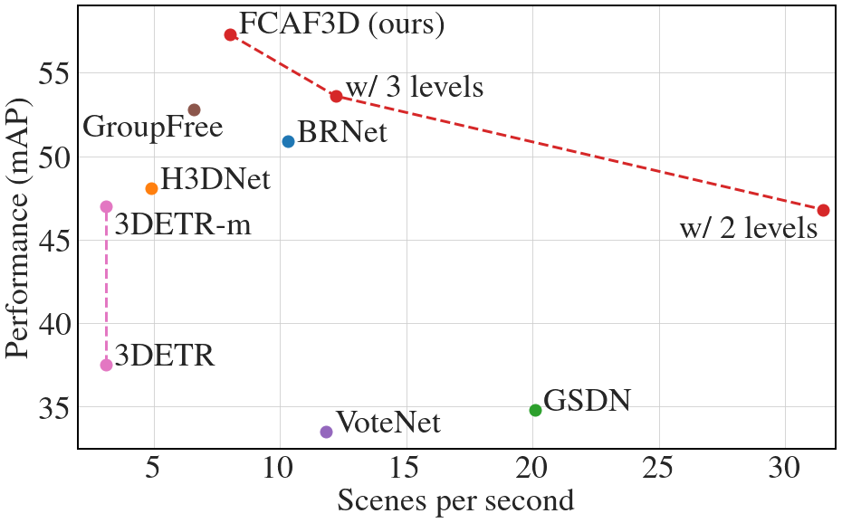
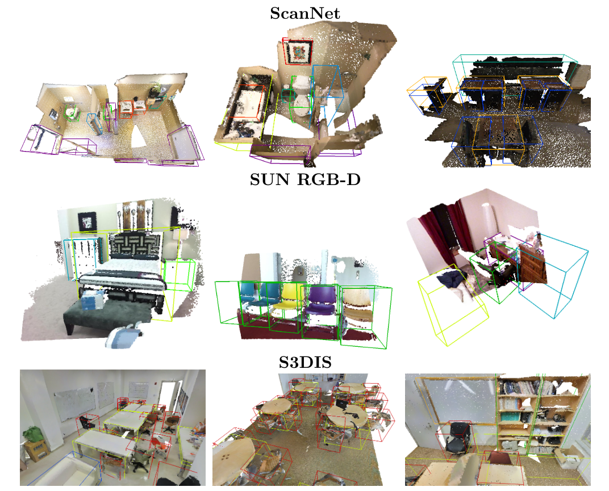

# FCAF3D: Fully Convolutional Anchor-Free 3D Object Detection

This repository contains implementation of the 3D object detector FCAF3D, introduced in our paper:

> **FCAF3D: Fully Convolutional Anchor-Free 3D Object Detection**<br>
> [Danila Rukhovich](https://github.com/filaPro),
> [Anna Vorontsova](https://github.com/highrut),
> [Anton Konushin](https://scholar.google.com/citations?user=ZT_k-wMAAAAJ)
> <br>
> Samsung AI Center Moscow <br>
> https://arxiv.org/abs/21??.?????

<p align="center"></p>

### Installation
For convenience, we provide a [Dockerfile](docker/Dockerfile). Alternatively, you can install all required packages manually.

This implementation is based on [mmdetection3d](https://github.com/open-mmlab/mmdetection3d) framework.
Please refer to the original installation guide [install.md](docs/install.md), replacing `open-mmlab/mmdetection3d` with `saic-vul/fcaf3d`.
Also, [MinkowskiEngine](https://github.com/NVIDIA/MinkowskiEngine) and [rotated_iou](https://github.com/lilanxiao/Rotated_IoU) should be installed with [these](https://github.com/saic-vul/fcaf3d/blob/master/docker/Dockerfile#L35-L38) 4 commands.

Most of the `FCAF3D`-related code locates in the following files: 
[detectors/single_stage_sparse.py](mmdet3d/models/detectors/single_stage_sparse.py),
[necks/fcaf3d_neck_with_head.py](mmdet3d/models/dense_heads/fcaf3d_neck_with_head.py),
[backbones/me_resnet.py](mmdet3d/models/backbones/me_resnet.py).

### Getting Started

Please see [getting_started.md](docs/getting_started.md) for basic usage examples.
We use data preparation from `mmdetection3d`, following documentation in [scannet](data/scannet), [sunrgbd](data/sunrgbd) and [s3dis](data/s3dis).
The only difference is [disabling](https://github.com/saic-vul/fcaf3d/blob/master/tools/data_converter/sunrgbd_data_utils.py#L143) sampling 50000 points for `SUN RGB-D` on this step to use all points further.

**Training**

To start training, run [dist_train](tools/dist_train.sh) with `FCAF3D` [configs](configs/fcaf3d):
```shell
bash tools/dist_train.sh configs/fcaf3d/fcaf3d_scannet-3d-18class.py 2
```

**Testing**

Test pre-trained model using [dist_test](tools/dist_test.sh) with `FCAF3D` [configs](configs/fcaf3d):
```shell
bash tools/dist_test.sh configs/fcaf3d/fcaf3d_scannet-3d-18class.py \
    work_dirs/fcaf3d_scannet-3d-18class/latest.pth 2 --eval mAP
```

**Visualization**

Visualizations can be created with [test](tools/test.py) script. 
For better visualizations, you may set `score_thr` in configs to `0.20`:
```shell
python tools/test.py configs/fcaf3d/fcaf3d_scannet-3d-18class.py \
    work_dirs/fcaf3d_scannet-3d-18class/latest.pth --show \
    --show-dir work_dirs/fcaf3d_scannet-3d-18class
```

### Models

The metrics are given for 5 training runs followed by 5 test runs. Average values are is round brackets.

For `VoteNet` and `ImVoteNet` we provide the configs and checkpoints with our Mobius angle parametrization.
We also remove 4 losses in favour of rotated IoU loss. 
`ImVoxelNet` ablations can be done directly in [imvoxelnet](https://github.com/saic-vul/imvoxelnet) repository as it is not supported for indoor scenes in `mmdetection3d`.

**FCAF3D**

| Dataset   | mAP@0.25 | mAP@0.5 | Download |
|:---------:|:--------:|:-------:|:--------:|
| ScanNet | 71.5 (70.7) | 57.3 (56.0) | [model](https://github.com/saic-vul/fcaf3d/releases/download/v1.0/2021????_??????.pth) &#124; [log](https://github.com/saic-vul/fcaf3d/releases/download/v1.0/2021????_fcaf3d_scannet.log) &#124; [config](configs/fcaf3d/fcaf3d_scannet-3d-18class.py) |
| SUN RGB-D | 64.2 (63.8) | 48.9 (48.2) | [model](https://github.com/saic-vul/fcaf3d/releases/download/v1.0/2021????_??????.pth) &#124; [log](https://github.com/saic-vul/fcaf3d/releases/download/v1.0/2021????_fcaf3d_sunrgbd.log) &#124; [config](configs/fcaf3d/fcaf3d_sunrgbd-3d-10class.py) |
| S3DIS | 66.7 (64.9) | 45.9 (43.8) | [model](https://github.com/saic-vul/fcaf3d/releases/download/v1.0/2021????_??????.pth) &#124; [log](https://github.com/saic-vul/fcaf3d/releases/download/v1.0/2021????_fcaf3d_s3dis.log) &#124; [config](configs/fcaf3d/fcaf3d_s3dis-3d-5class.py) |


**VoteNet on SUN RGB-D**

| Source   | mAP@0.25 | mAP@0.5 | Download |
|:---------:|:--------:|:-------:|:--------:|
| mmdetection3d | 59.1 | 35.8| [instruction](configs/votenet) |
| ours | 61.1 (60.5) | 40.4 (39.5) | [model](https://github.com/saic-vul/fcaf3d/releases/download/v1.0/2021????_??????.pth) &#124; [log](https://github.com/saic-vul/fcaf3d/releases/download/v1.0/2021????_votenet_sunrgbd.log) &#124; [config](configs/votenet/votenet-v2_16x8_sunrgbd-3d-10class.py) |

**ImVoteNet on SUN RGB-D**

| Source   | mAP@0.25 | mAP@0.5 | Download |
|:---------:|:--------:|:-------:|:--------:|
| mmdetection3d | 64.0 | 37.8 | [instruction](configs/imvotenet) |
| ours | 64.6 (64.1) | 40.8 (39.8) | [model](https://github.com/saic-vul/fcaf3d/releases/download/v1.0/2021????_??????.pth) &#124; [log](https://github.com/saic-vul/fcaf3d/releases/download/v1.0/2021????_imvotenet_sunrgbd.log) &#124; [config](configs/imvotenet/imvotenet-v2_stage2_16x8_sunrgbd-3d-10class.py) |

### Example Detections

<p align="center"></p>

### Citation

If you find this work useful for your research, please cite our paper:
```
@article{rukhovich2021fcaf3d,
  title={FCAF3D: Fully Convolutional Anchor-Free 3D Object Detection},
  author={Danila Rukhovich, Anna Vorontsova, Anton Konushin},
  journal={arXiv preprint arXiv:21??.?????},
  year={2021}
}
```
